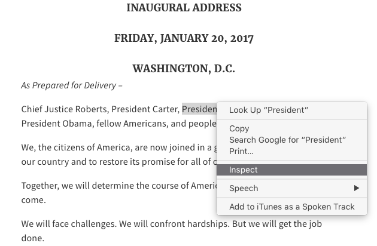

# Collecting, cleaning, and analyzing text in R

<p class="myauthor" align="right">
Document created by<br><a href="http://mikewk.com">Michael W. Kearney</a>, Assistant Professor<br>Journalism Studies | Data Science & Analytics<br>School of Journalism | Informatics Institute<br>University of Missouri
</p>

## Summary

The goal of this tutorial is to provide a replicable example of how to gather
and analyze text in R. In the code that follows, the text of Trump's inaugural
address is scraped from the web using the rvest package. The sentiment of the
text is then analyzed using Google Cloud's Natural Language API, accessed via
the googleapis package. Finally, the tidyverse is used to wrangle and visualize
the results.

## Packages

The [rvest](https://github.com/hadley/rvest) package will be used to scrape
the transcript text from https://www.whitehouse.gov/inaugural-address.

```{r}
if (any(!"rvest" %in% installed.packages())) {
  install.packages("rvest")
}
suppressPackageStartupMessages(library(rvest))
```

The [googleapis](https://github.com/mkearney/googleapis) package will be used
to analyze the sentiment of the text.

```{r}
if (any(!"devtools" %in% installed.packages())) {
  install.packages("devtools")
}
devtools::install_github("mkearney/googleapis")
library(googleapis)
```

The [tidyverse](https://tidyverse.org) packages will be used to wrangle and
visualize the data.

```{r}
if (any(!"rvest" %in% installed.packages())) {
  install.packages("rvest")
}
suppressPackageStartupMessages(library(rvest))
```

## Web scraping

Read into R the source code from https://www.whitehouse.gov/inaugural-address
using `read_html()` (imported from [xml2](https://github.com/hadley/xml2) by
rvest).

```{r}
r <- read_html(
  "https://www.whitehouse.gov/inaugural-address"
)
```

Open the inaugural address URL in a web browser. The `browseURL()` function will
do this for you.

```{r, eval=FALSE}
browseURL("https://www.whitehouse.gov/inaugural-address")
```

Once the page has loaded, inspect the source code. To view the source code in a
Chrome browser, right click the webpage and select "inspect" (there should be
similar ways to view the source code in other browsers as well).

<p align="center"> 

</p>

In the developer menu that opens, find and click on the selector button (looks
like an arrow inside a square). It should be toward the top of the inspect
panel, next other menu options like "Elements" and "Console."

<p align="center"> 

</p>

Next, click on the first line of the transcript.

<p align="center"> 

</p>

That should jump you to the relevant source code. Now the goal is to try to
identify a pattern that distinguishes the transcript text from the rest of the
page. For instance, it looks like the class attribute
`field-name-field-transcript` seems like it might be a unique identifier.

<p align="center"> </p>

Use `html_nodes()` from rvest to identify nodes by class attribute---to indicate
that this is a class attribute, make sure the field begins with a period. Use
`html_text()` to extract the text from the selected nodes.

```{r}
inaug45 <- r %>%
  html_nodes(".field-name-field-transcript") %>%
  html_text()
```

This leaves us with one long text string.

```{r}
inaug45
```

## Cleaning text

It looks like every paragraph is separated by three line breaks and a tab. So,
to tokenize the text into paragraphs, split on `\n\n\n\t` (line break,
linebreak, linebreak, tab), using two backslashes---the first escapes the
second.

```{r}
inaug45 <- strsplit(inaug45, "\\n\\n\\n\\t")[[1]]
```

Preview first three paragraphs of the address.

```{r}
inaug45[1:3]
```

The first paragraph, which reads `\n\tAs Prepared for Delivery –`, is just a
transcript marker, so drop it.

```{r}
inaug45 <- inaug45[-1]
```

Remove remaining line breaks, tabs, and trim white space from ends.

```{r}
inaug45 <- gsub(
  "\\n|\\t|^\\s{1,}|\\s{1,}$", "", inaug45
)
```

Remove extra spaces.

```{r}
inaug45 <- gsub("\\s{2,}", " ", inaug45)
```

## Analyzing sentiment

Analyze the sentiment of the text using `analyse_sentiment()` from the
googleapis package.

```{r}
sa <- analyze_sentiment(inaug45)
```

Convert the returned object into a tidy tbl (data frame).

```{r}
d <- tibble::as_tibble(sa)
```

Preview the data.

```{r}
d
```

## Exploring the data

Load the tidyverse to handle and visualize data.

```{r}
suppressPackageStartupMessages(library(tidyverse))
```

Plot positive/negative sentiment over time (by paragraph number).

```{r}
d %>%
  filter(unit == "document") %>%
  select(Paragraph = id, Sentiment = score) %>%
  ggplot(aes(Paragraph, Sentiment)) + 
  geom_line() + 
  geom_point()
```

Apply smoothing method.

```{r}
d %>%
  filter(unit == "document") %>%
  select(Paragraph = id, Sentiment = score) %>%
  ggplot(aes(Paragraph, Sentiment)) + 
  geom_smooth(method = "loess", span = .15)
```

The most negative paragraphs appear to be 30-33(ish).

```{r}
inaug45[30:33]
```

The most positive paragraphs appear to be 55-58(ish).

```{r}
inaug45[55:58]
```


<style>p.myauthor a {color: #777 !important;} p.myauthor {color: #777 !important;}</style>
