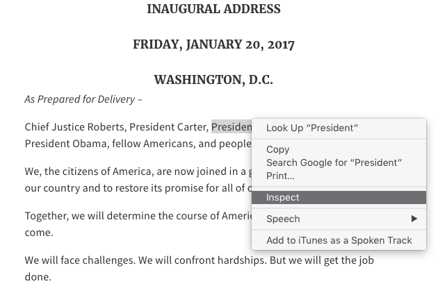
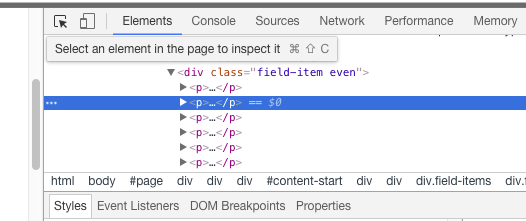
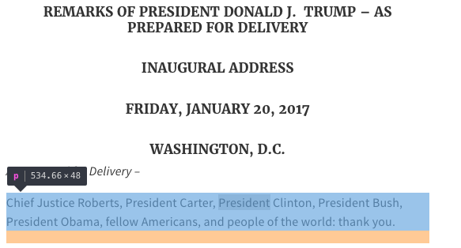
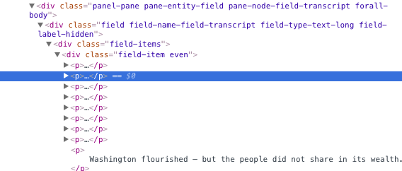
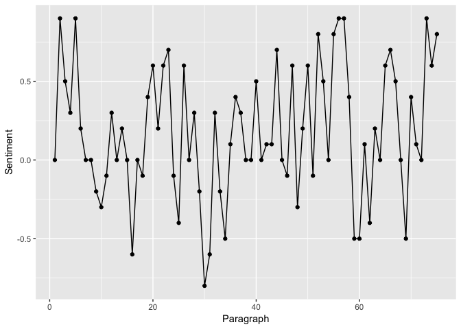

Collecting, cleaning, and analyzing text in R
=============================================

<p class="myauthor" align="right">
Document created by<br><a href="http://mikewk.com">Michael W. Kearney</a>, Assistant Professor<br>Journalism Studies | Data Science & Analytics<br>School of Journalism | Informatics Institute<br>University of Missouri
</p>
Summary
-------

The goal of this tutorial is to provide a replicable example of how to gather and analyze text in R. In the code that follows, the text of Trump's inaugural address is scraped from the web using the rvest package. The sentiment of the text is then analyzed using Google Cloud's Natural Language API, accessed via the googleapis package. Finally, the tidyverse is used to wrangle and visualize the results.

Packages
--------

The [rvest](https://github.com/hadley/rvest) package will be used to scrape the transcript text from <https://www.whitehouse.gov/inaugural-address>.

``` r
if (any(!"rvest" %in% installed.packages())) {
  install.packages("rvest")
}
suppressPackageStartupMessages(library(rvest))
```

The [googleapis](https://github.com/mkearney/googleapis) package will be used to analyze the sentiment of the text.

``` r
if (any(!"devtools" %in% installed.packages())) {
  install.packages("devtools")
}
devtools::install_github("mkearney/googleapis")
```

    ## Downloading GitHub repo mkearney/googleapis@master
    ## from URL https://api.github.com/repos/mkearney/googleapis/zipball/master

    ## Installing googleapis

    ## '/Library/Frameworks/R.framework/Resources/bin/R' --no-site-file  \
    ##   --no-environ --no-save --no-restore --quiet CMD INSTALL  \
    ##   '/private/var/folders/8r/hld4q1j94w7_01g81s7060yd322dmk/T/Rtmp21d9or/devtools8f4b5ca75dbb/mkearney-googleapis-b802cb7'  \
    ##   --library='/Library/Frameworks/R.framework/Versions/3.4/Resources/library'  \
    ##   --install-tests

    ## 

``` r
library(googleapis)
```

The [tidyverse](https://tidyverse.org) packages will be used to wrangle and visualize the data.

``` r
if (any(!"rvest" %in% installed.packages())) {
  install.packages("rvest")
}
suppressPackageStartupMessages(library(rvest))
```

Web scraping
------------

Read into R the source code from <https://www.whitehouse.gov/inaugural-address> using `read_html()` (imported from [xml2](https://github.com/hadley/xml2) by rvest).

``` r
r <- read_html(
  "https://www.whitehouse.gov/inaugural-address"
)
```

Open the inaugural address URL in a web browser. The `browseURL()` function will do this for you.

``` r
browseURL("https://www.whitehouse.gov/inaugural-address")
```

Once the page has loaded, inspect the source code. To view the source code in a Chrome browser, right click the webpage and select "inspect" (there should be similar ways to view the source code in other browsers as well).

<p align="center">

</p>
In the developer menu that opens, find and click on the selector button (looks like an arrow inside a square). It should be toward the top of the inspect panel, next other menu options like "Elements" and "Console."

<p align="center">

</p>
Next, click on the first line of the transcript.

<p align="center">

</p>
That should jump you to the relevant source code. Now the goal is to try to identify a pattern that distinguishes the transcript text from the rest of the page. For instance, it looks like the class attribute `field-name-field-transcript` seems like it might be a unique identifier.

<p align="center">

</p>
Use `html_nodes()` from rvest to identify nodes by class attribute---to indicate that this is a class attribute, make sure the field begins with a period. Use `html_text()` to extract the text from the selected nodes.

``` r
inaug45 <- r %>%
  html_nodes(".field-name-field-transcript") %>%
  html_text()
```

This leaves us with one long text string.

``` r
inaug45
```

    ## [1] "\n\tAs Prepared for Delivery –\n\n\n\tChief Justice Roberts, President Carter, President Clinton, President Bush, President Obama, fellow Americans, and people of the world: thank you.\n\n\n\tWe, the citizens of America, are now joined in a great national effort to rebuild our country and to restore its promise for all of our people.\n\n\n\tTogether, we will determine the course of America and the world for years to come.\n\n\n\tWe will face challenges. We will confront hardships. But we will get the job done.\n\n\n\tEvery four years, we gather on these steps to carry out the orderly and peaceful transfer of power, and we are grateful to President Obama and First Lady Michelle Obama for their gracious aid throughout this transition. They have been magnificent.\n\n\n\tToday’s ceremony, however, has very special meaning. Because today we are not merely transferring power from one Administration to another, or from one party to another – but we are transferring power from Washington, D.C. and giving it back to you, the American People.\n\n\n\tFor too long, a small group in our nation’s Capital has reaped the rewards of government while the people have borne the cost.\n\n\n\tWashington flourished – but the people did not share in its wealth.\n\n\n\tPoliticians prospered – but the jobs left, and the factories closed.\n\n\n\tThe establishment protected itself, but not the citizens of our country.\n\n\n\tTheir victories have not been your victories; their triumphs have not been your triumphs; and while they celebrated in our nation’s Capital, there was little to celebrate for struggling families all across our land.\n\n\n\tThat all changes – starting right here, and right now, because this moment is your moment: it belongs to you.\n\n\n\tIt belongs to everyone gathered here today and everyone watching all across America. \n\n\n\tThis is your day. This is your celebration.\n\n\n\tAnd this, the United States of America, is your country.\n\n\n\tWhat truly matters is not which party controls our government, but whether our government is controlled by the people.\n\n\n\tJanuary 20th 2017, will be remembered as the day the people became the rulers of this nation again. \n\n\n\tThe forgotten men and women of our country will be forgotten no longer.\n\n\n\tEveryone is listening to you now.\n\n\n\tYou came by the tens of millions to become part of a historic movement the likes of which the world has never seen before.\n\n\n\tAt the center of this movement is a crucial conviction: that a nation exists to serve its citizens.\n\n\n\tAmericans want great schools for their children, safe neighborhoods for their families, and good jobs for themselves.\n\n\n\tThese are the just and reasonable demands of a righteous public.\n\n\n\tBut for too many of our citizens, a different reality exists: Mothers and children trapped in poverty in our inner cities; rusted-out factories scattered like tombstones across the landscape of our nation; an education system, flush with cash, but which leaves our young and beautiful students deprived of knowledge; and the crime and gangs and drugs that have stolen too many lives and robbed our country of so much unrealized potential.\n\n\n\tThis American carnage stops right here and stops right now.\n\n\n\tWe are one nation – and their pain is our pain.  Their dreams are our dreams; and their success will be our success.  We share one heart, one home, and one glorious destiny.\n\n\n\tThe oath of office I take today is an oath of allegiance to all Americans.\n\n\n\tFor many decades, we’ve enriched foreign industry at the expense of American industry;\n\n\n\tSubsidized the armies of other countries while allowing for the very sad depletion of our military;\n\n\n\tWe've defended other nation’s borders while refusing to defend our own;\n\n\n\tAnd spent trillions of dollars overseas while America's infrastructure has fallen into disrepair and decay.\n\n\n\tWe’ve made other countries rich while the wealth, strength, and confidence of our country has disappeared over the horizon.\n\n\n\tOne by one, the factories shuttered and left our shores, with not even a thought about the millions upon millions of American workers left behind.\n\n\n\tThe wealth of our middle class has been ripped from their homes and then redistributed across the entire world.\n\n\n\tBut that is the past. And now we are looking only to the future.\n\n\n\tWe assembled here today are issuing a new decree to be heard in every city, in every foreign capital, and in every hall of power.\n\n\n\tFrom this day forward, a new vision will govern our land.\n\n\n\tFrom this moment on, it’s going to be America First.\n\n\n\tEvery decision on trade, on taxes, on immigration, on foreign affairs, will be made to benefit American workers and American families.\n\n\n\tWe must protect our borders from the ravages of other countries making our products, stealing our companies, and destroying our jobs.  Protection will lead to great prosperity and strength.\n\n\n\tI will fight for you with every breath in my body – and I will never, ever let you down.\n\n\n\tAmerica will start winning again, winning like never before.\n\n\n\tWe will bring back our jobs. We will bring back our borders.  We will bring back our wealth.  And we will bring back our dreams.\n\n\n\tWe will build new roads, and highways, and bridges, and airports, and tunnels, and railways all across our wonderful nation.\n\n\n\tWe will get our people off of welfare and back to work – rebuilding our country with American hands and American labor.\n\n\n\tWe will follow two simple rules: Buy American and Hire American.\n\n\n\tWe will seek friendship and goodwill with the nations of the world – but we do so with the understanding that it is the right of all nations to put their own interests first.\n\n\n\tWe do not seek to impose our way of life on anyone, but rather to let it shine as an example for everyone to follow.\n\n\n\tWe will reinforce old alliances and form new ones – and unite the civilized world against Radical Islamic Terrorism, which we will eradicate completely from the face of the Earth.\n\n\n\tAt the bedrock of our politics will be a total allegiance to the United States of America, and through our loyalty to our country, we will rediscover our loyalty to each other.\n\n\n\tWhen you open your heart to patriotism, there is no room for prejudice.\n\n\n\tThe Bible tells us, “how good and pleasant it is when God’s people live together in unity.”\n\n\n\tWe must speak our minds openly, debate our disagreements honestly, but always pursue solidarity.\n\n\n\tWhen America is united, America is totally unstoppable.\n\n\n\tThere should be no fear – we are protected, and we will always be protected.\n\n\n\tWe will be protected by the great men and women of our military and law enforcement and, most importantly, we are protected by God.\n\n\n\tFinally, we must think big and dream even bigger.\n\n\n\tIn America, we understand that a nation is only living as long as it is striving.\n\n\n\tWe will no longer accept politicians who are all talk and no action – constantly complaining but never doing anything about it.\n\n\n\tThe time for empty talk is over.\n\n\n\tNow arrives the hour of action.\n\n\n\tDo not let anyone tell you it cannot be done.  No challenge can match the heart and fight and spirit of America.\n\n\n\tWe will not fail. Our country will thrive and prosper again.\n\n\n\tWe stand at the birth of a new millennium, ready to unlock the mysteries of space, to free the Earth from the miseries of disease, and to harness the energies, industries and technologies of tomorrow.\n\n\n\tA new national pride will stir our souls, lift our sights, and heal our divisions.\n\n\n\tIt is time to remember that old wisdom our soldiers will never forget: that whether we are black or brown or white, we all bleed the same red blood of patriots, we all enjoy the same glorious freedoms, and we all salute the same great American Flag.\n\n\n\tAnd whether a child is born in the urban sprawl of Detroit or the windswept plains of Nebraska, they look up at the same night sky, they fill their heart with the same dreams, and they are infused with the breath of life by the same almighty Creator.\n\n\n\tSo to all Americans, in every city near and far, small and large, from mountain to mountain, and from ocean to ocean, hear these words:\n\n\n\tYou will never be ignored again.\n\n\n\tYour voice, your hopes, and your dreams, will define our American destiny. And your courage and goodness and love will forever guide us along the way.\n\n\n\tTogether, We Will Make America Strong Again.\n\n\n\tWe Will Make America Wealthy Again.\n\n\n\tWe Will Make America Proud Again.\n\n\n\tWe Will Make America Safe Again.\n\n\n\tAnd, Yes, Together, We Will Make America Great Again. Thank you, God Bless You, And God Bless America.\n"

Cleaning text
-------------

It looks like every paragraph is separated by three line breaks and a tab. So, to tokenize the text into paragraphs, split on `\n\n\n\t` (line break, linebreak, linebreak, tab), using two backslashes---the first escapes the second.

``` r
inaug45 <- strsplit(inaug45, "\\n\\n\\n\\t")[[1]]
```

Preview first three paragraphs of the address.

``` r
inaug45[1:3]
```

    ## [1] "\n\tAs Prepared for Delivery –"                                                                                                                    
    ## [2] "Chief Justice Roberts, President Carter, President Clinton, President Bush, President Obama, fellow Americans, and people of the world: thank you."
    ## [3] "We, the citizens of America, are now joined in a great national effort to rebuild our country and to restore its promise for all of our people."

The first paragraph, which reads `\n\tAs Prepared for Delivery –`, is just a transcript marker, so drop it.

``` r
inaug45 <- inaug45[-1]
```

Remove remaining line breaks, tabs, and trim white space from ends.

``` r
inaug45 <- gsub(
  "\\n|\\t|^\\s{1,}|\\s{1,}$", "", inaug45
)
```

Remove extra spaces.

``` r
inaug45 <- gsub("\\s{2,}", " ", inaug45)
```

Analyzing sentiment
-------------------

Analyze the sentiment of the text using `analyse_sentiment()` from the googleapis package.

``` r
sa <- analyze_sentiment(inaug45)
```

Convert the returned object into a tidy tbl (data frame).

``` r
d <- tibble::as_tibble(sa)
```

Preview the data.

``` r
d
```

    ## # A tibble: 166 x 7
    ##       id     unit score magnitude position offset
    ##  * <int>    <chr> <dbl>     <dbl>    <int>  <int>
    ##  1     1 document   0.0       0.0       NA     NA
    ##  2     1 sentence   0.0       0.0        1      0
    ##  3     2 document   0.9       0.9       NA     NA
    ##  4     2 sentence   0.9       0.9        1      0
    ##  5     3 document   0.5       0.5       NA     NA
    ##  6     3 sentence   0.5       0.5        1      0
    ##  7     4 document   0.3       1.0       NA     NA
    ##  8     4 sentence   0.5       0.5        1      0
    ##  9     4 sentence   0.0       0.0        2     25
    ## 10     4 sentence   0.4       0.4        3     53
    ## # ... with 156 more rows, and 1 more variables: content <chr>

Exploring the data
------------------

Load the tidyverse to handle and visualize data.

``` r
suppressPackageStartupMessages(library(tidyverse))
```

Plot positive/negative sentiment over time (by paragraph number).

``` r
d %>%
  filter(unit == "document") %>%
  select(Paragraph = id, Sentiment = score) %>%
  ggplot(aes(Paragraph, Sentiment)) + 
  geom_line() + 
  geom_point()
```



Apply smoothing method.

``` r
d %>%
  filter(unit == "document") %>%
  select(Paragraph = id, Sentiment = score) %>%
  ggplot(aes(Paragraph, Sentiment)) + 
  geom_smooth(method = "loess", span = .15)
```


The most negative paragraphs appear to be 30-33(ish).

``` r
inaug45[30:33]
```

    ## [1] "We've defended other nation’s borders while refusing to defend our own;"                                                                           
    ## [2] "And spent trillions of dollars overseas while America's infrastructure has fallen into disrepair and decay."                                       
    ## [3] "We’ve made other countries rich while the wealth, strength, and confidence of our country has disappeared over the horizon."                       
    ## [4] "One by one, the factories shuttered and left our shores, with not even a thought about the millions upon millions of American workers left behind."

The most positive paragraphs appear to be 55-58(ish).

``` r
inaug45[55:58]
```

    ## [1] "There should be no fear – we are protected, and we will always be protected."                                                       
    ## [2] "We will be protected by the great men and women of our military and law enforcement and, most importantly, we are protected by God."
    ## [3] "Finally, we must think big and dream even bigger."                                                                                  
    ## [4] "In America, we understand that a nation is only living as long as it is striving."

<style>p.myauthor a {color: #777 !important;} p.myauthor {color: #777 !important;}</style>
